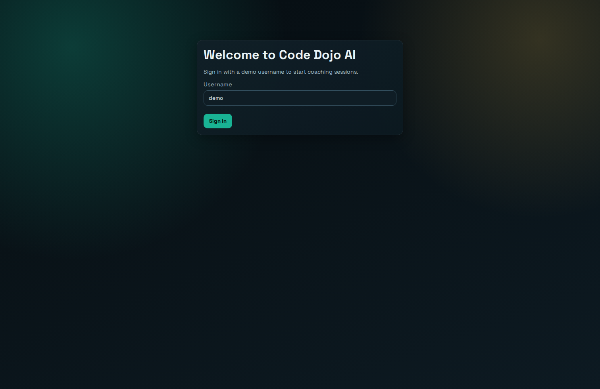
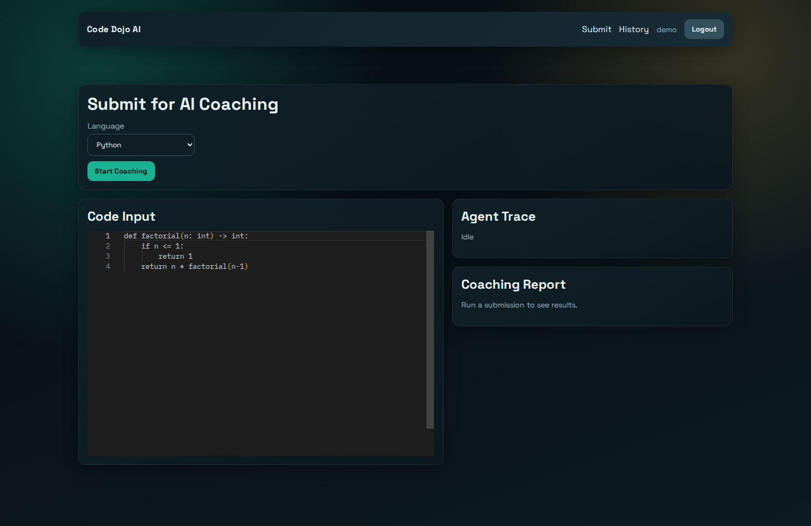
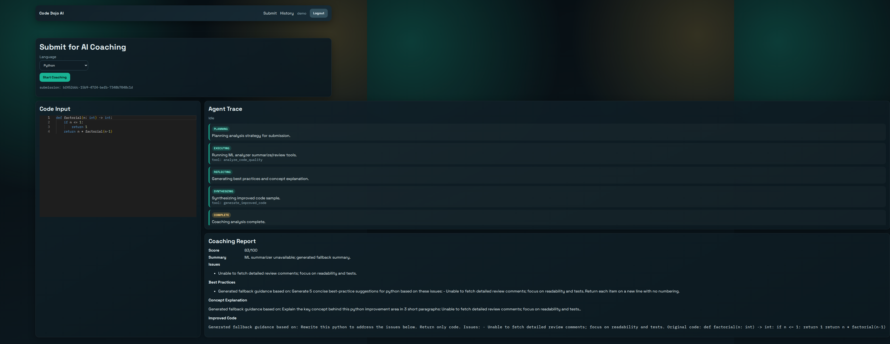
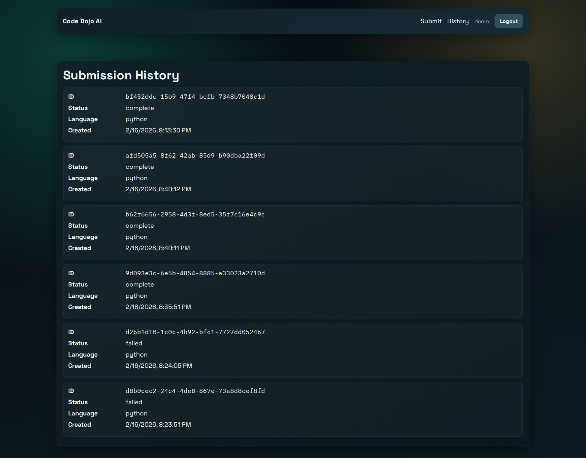
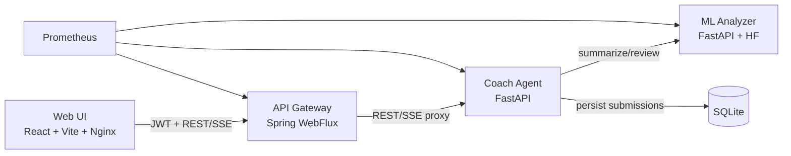

# Code Dojo AI

Portfolio demo with four services:
- `services/ml-analyzer` (FastAPI + Hugging Face)
- `services/coach-agent` (FastAPI + agent orchestration + SQLite)
- `services/api-gateway` (Spring Boot WebFlux + JWT)
- `services/web-ui` (React + Vite)

## Demo
- Live flow: demo auth -> code submit -> streamed agent trace -> persisted history.
- API examples: `docs/contracts.md`.

### UI Screenshots





## Architecture


## Prerequisites
- Python 3.12+
- Node 22+
- Java 21+
- Maven 3.9+
- Docker / Docker Compose (recommended)

## Local Run (Container-first)
```bash
cp .env.example .env
# update APP_JWT_SECRET in .env
docker compose up --build
```

Endpoints:
- UI: `http://localhost`
- API Gateway: `http://localhost:8080`
- Coach Agent: `http://localhost:8000`
- ML Analyzer: `http://localhost:8001`
- Prometheus: `http://localhost:9090`

## Local Run (without Docker)
1. Start `ml-analyzer`.
2. Start `coach-agent`.
3. Start `api-gateway`.
4. Start `web-ui`.

See `docs/contracts.md` for API contracts.
